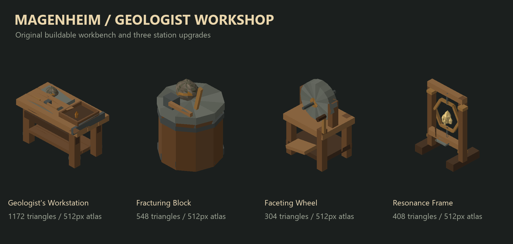

# Magenheim

**Magic begins as geology.**

## Installed content test: 0.0.16

Eleven original low-poly models, eleven 512px texture atlases, and twelve icons
are now connected to game content:

- Meadows Earth geode and its larger mineable world object.
- Rough, Simple, Crystal, Advanced, and Master Earth crystals; Earth Crystal Shards.
- Crystal Shaping with permanent identity `magenheim.crystal_shaping`.
- Geologist's Workstation, Fracturing Block, Faceting Wheel, and Resonance Frame.

## Try the content

Launch Modded from r2modman's **Central Fuckery** profile. Use **Hammer > Crafting**
for the workshop. The main bench requires a nearby vanilla Workbench; its three
upgrades connect to the Geologist's Workstation within five meters. Build costs,
spawn commands, and placement checks are in [TESTING.md](TESTING.md).

The main bench costs 10 Wood, 10 Stone, and 2 Flint. It works outdoors. Each upgrade
has its own original model, icon, collision shape, and wear appearance. Different
upgrades raise its station level; duplicate copies of one upgrade do not stack.

This is a content test. Mineral opening/refinement actions, mineral crafting
recipes, and earned skill XP are not connected yet. The workstation's crafting
panel currently has no mineral recipes. Placement, mining/drop behavior,
save/reload, and multiplayer require disposable-world tests.

## Verified

The core harness reports 113 assertions passed. Runtime compilation has zero
warnings/errors against installed Valheim and Jotunn 2.30.0. All eleven models
pass closed-surface, outward-winding, UV, atlas, and transparent-icon checks.

An isolated Valheim startup using the packaged DLLs registered all mineral items,
the skill, the four workshop pieces, and one Meadows geode vegetation addition.
No Magenheim registration error was recorded. This startup check did not load a
world or establish in-game visual, placement, mining, or persistence correctness.

Version 0.0.16 is installed and hash-verified in the active profile. See the
[workshop validation record](docs/validation/2026-09-14-workshop-content.md).

## Source and package

Editable OBJ/MTL files, mesh JSON, PNG atlases/icons, and original art generators
are included under `assets/earth` and `tools`. Players need no art tools or editor.

Run `build.ps1` to test, compile, and create `dist/Local-Magenheim-0.0.16.zip`.
With Valheim closed, `install-local.ps1` backs up and installs into the selected
r2modman profile, then verifies file hashes. Third-party and framework DLLs are
not included in the package. The local SDK is under ignored `dist/toolchain`.

Development remains on `main`; follow `INSTRUCTIONS.md` for project authority.
